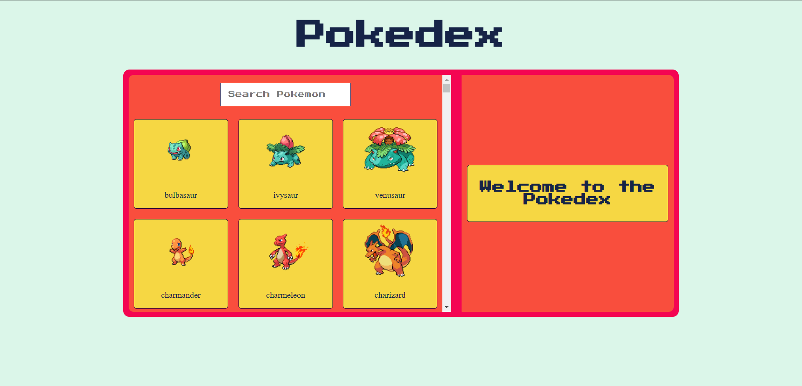
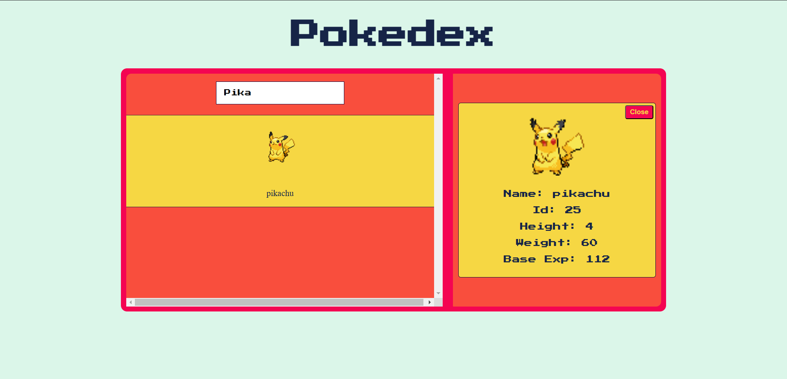

# Pokedex
Pokedex is a React project built to learn TypeScript basics and explore key React concepts. Users can search for Pokémon and view detailed information. 

### Screenshots

### React Concepts Covered:

1. **Functional Components**: The app is built using functional components, which are now the standard in modern React development.

2. **Hooks**:

   * `useState`: For managing component state, such as storing Pokémon data and managing loading states.

   * `useEffect`: To fetch data from the Pokémon API when the component mounts, demonstrating the concept of side effects in React.

3. **API Integration**: 
   * **Fetch API**: Used inside useEffect to get data from the Pokémon API, showcasing how to handle asynchronous data fetching in React.

4. **Conditional Rendering**: The app conditionally renders components based on the loading state and available data.

5. **Props Handling**: Data is passed down to child components using props, promoting reusable components and separation of concerns.

6. **Dynamic Rendering**: The list of Pokémon is rendered dynamically using the `.map()` method, a key concept for rendering lists in React.

 

### References:
---
For UI Colors: [ColorHunt](https://colorhunt.co/)

Font used: [Press Start 2P](https://fonts.google.com/specimen/Press+Start+2P)
